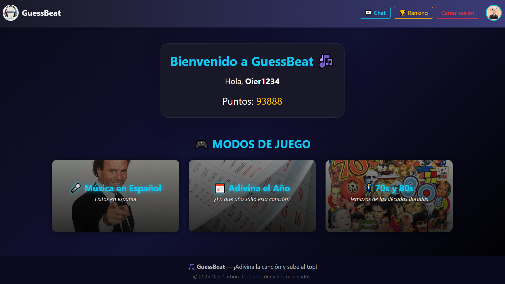
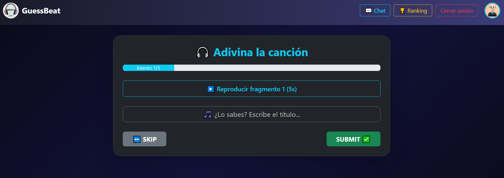
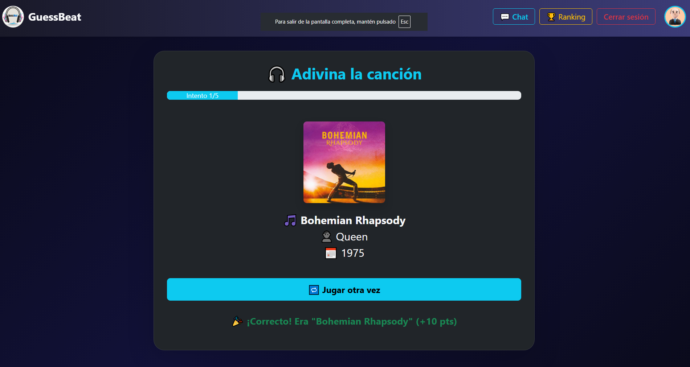
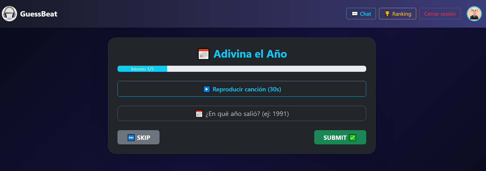
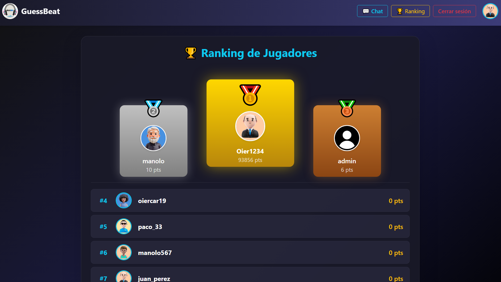
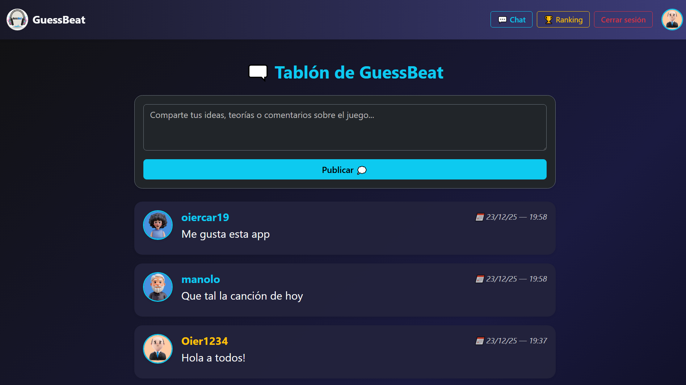
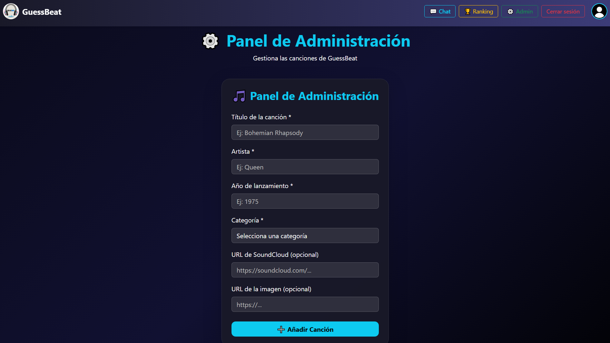
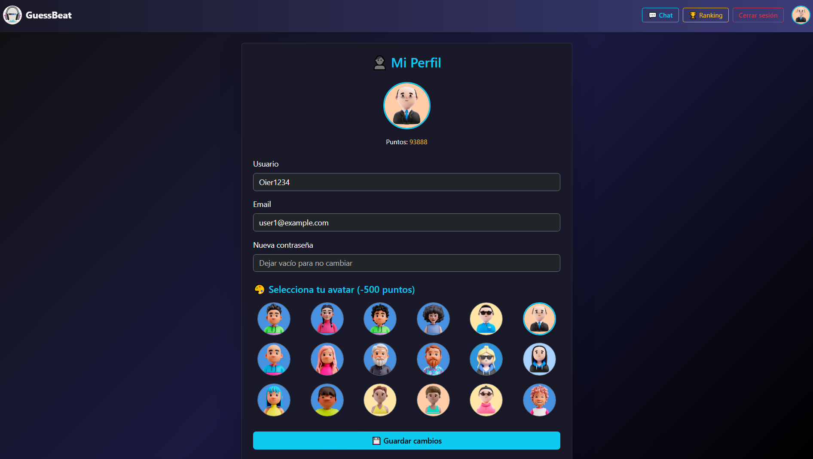

# 🎵 GuessBeat

GuessBeat es una plataforma de juego musical interactiva donde los usuarios compiten adivinando canciones. El proyecto está construido con una arquitectura de microservicios, utilizando tecnologías modernas tanto en el frontend como en el backend.

## 📋 Tabla de Contenidos

- [Descripción](#-descripción)
- [Arquitectura](#-arquitectura)
- [Tecnologías](#-tecnologías)
- [Prerequisitos](#-prerequisitos)
- [Instalación y Ejecución](#-instalación-y-ejecución)
  - [Con Docker (Recomendado)](#con-docker-recomendado)
  - [Instalación Manual](#instalación-manual)
- [Estructura del Proyecto](#-estructura-del-proyecto)
- [API Documentation](#-api-documentation)
- [Variables de Entorno](#-variables-de-entorno)
- [Puertos](#-puertos)
- [Características](#-características)
- [Capturas de Pantalla](#-capturas-de-pantalla)

## 🎮 Descripción

GuessBeat es una aplicación web que permite a los usuarios:
- 🎵 Jugar adivinando canciones de diferentes categorías
- 👥 Competir con otros jugadores en tiempo real
- 💬 Chatear durante las partidas
- 🏆 Ver rankings y estadísticas
- 👤 Gestionar perfiles de usuario con autenticación
- 🔗 Integración con SoundCloud para música

## 🏗️ Arquitectura

El proyecto sigue una arquitectura de microservicios con los siguientes componentes:

```
┌─────────────┐
│   Frontend  │  (React + Vite)
│   :5173     │
└──────┬──────┘
       │
┌──────▼──────┐
│ API Gateway │  (Node.js + Express)
│   :5000     │
└──────┬──────┘
       │
       ├───────────────┬─────────────────┐
       │               │                 │
┌──────▼──────┐  ┌─────▼──────┐    ┌─────▼──────┐
│User Service │  │Game Service│    │  Databases │
│  :5001      │  │  :8002     │    │            │
│(Node.js)    │  │  (Python)  │    │ MongoDB    │
│             │  │            │    │ :27017     │
└─────────────┘  └────────────┘    │ MySQL      │
                                   │ :3307      │
                                   └────────────┘
```

### Microservicios:

1. **Frontend**: Interfaz de usuario construida con React y Vite
2. **API Gateway**: Punto de entrada único que enruta las peticiones a los microservicios
3. **User Service**: Gestión de usuarios, autenticación y chat (Node.js + MongoDB)
4. **Game Service**: Lógica del juego, categorías y rankings (Python FastAPI + MySQL)

## 🛠️ Tecnologías

### Frontend
- **React 19** - Framework UI
- **Vite** - Build tool y dev server
- **React Router** - Navegación
- **Axios** - Cliente HTTP
- **Bootstrap & Tailwind** - Estilos
- **SoundCloud Widget** - Reproductor de música

### Backend

#### API Gateway
- **Node.js** - Runtime
- **Express** - Framework web
- **http-proxy-middleware** - Proxy de peticiones
- **Swagger** - Documentación de API

#### User Service
- **Node.js** - Runtime
- **Express** - Framework web
- **MongoDB** - Base de datos NoSQL
- **Mongoose** - ODM
- **JWT** - Autenticación
- **bcryptjs** - Encriptación de contraseñas

#### Game Service
- **Python 3** - Lenguaje
- **FastAPI** - Framework web
- **MySQL 8** - Base de datos relacional
- **SQLAlchemy** - ORM
- **Uvicorn** - Servidor ASGI

### DevOps
- **Docker** - Contenerización
- **Docker Compose** - Orquestación de contenedores
- **Nginx** - Servidor web para frontend

## 📦 Prerequisitos

### Para ejecución con Docker:
- Docker Engine 20.10+
- Docker Compose 2.0+

### Para ejecución manual:
- Node.js 18+ y npm
- Python 3.9+
- MongoDB 6+
- MySQL 8+

## 🚀 Instalación y Ejecución

### Con Docker (Recomendado)

Esta es la forma más rápida y sencilla de ejecutar el proyecto completo.

#### 1. Clonar el repositorio
```bash
git clone <repository-url>
cd GuessBeat
```

#### 2. Configurar variables de entorno

Crea un archivo `.env` en la raíz del proyecto:

```env
# JWT
JWT_SECRET=tu_clave_secreta_jwt_muy_segura

# SoundCloud API
SOUNDCLOUD_CLIENT_ID=tu_soundcloud_client_id
SOUNDCLOUD_CLIENT_SECRET=tu_soundcloud_client_secret
SOUNDCLOUD_REDIRECT_URI=http://localhost:5001/api/soundcloud/callback
```

#### 3. Construir y ejecutar con Docker Compose

```bash
# Construir las imágenes y levantar todos los servicios
docker-compose up --build

# O en modo detached (segundo plano)
docker-compose up -d --build
```

#### 4. Verificar que todo está funcionando

Espera unos segundos a que todos los servicios estén listos. Puedes verificar el estado con:

```bash
docker-compose ps
```

#### 5. Acceder a la aplicación

- **Frontend**: http://localhost:5173
- **API Gateway**: http://localhost:5000
- **API Gateway Docs**: http://localhost:5000/api-docs
- **User Service**: http://localhost:5001
- **Game Service**: http://localhost:8002

#### Comandos útiles de Docker

```bash
# Ver logs de todos los servicios
docker-compose logs -f

# Ver logs de un servicio específico
docker-compose logs -f frontend
docker-compose logs -f api-gateway
docker-compose logs -f user-service
docker-compose logs -f game-service

# Detener todos los servicios
docker-compose down

# Detener y eliminar volúmenes (limpieza completa)
docker-compose down -v

# Reconstruir un servicio específico
docker-compose up -d --build frontend
```

---

### Instalación Manual

Si prefieres ejecutar los servicios de forma manual sin Docker:

#### 1. Clonar el repositorio
```bash
git clone <repository-url>
cd GuessBeat
```

#### 2. Instalar y configurar MongoDB

```bash
# Instalar MongoDB 6
# Windows: Descargar desde https://www.mongodb.com/try/download/community
# Linux: sudo apt-get install mongodb-org
# macOS: brew install mongodb-community@6.0

# Iniciar MongoDB
# Windows: net start MongoDB
# Linux/macOS: sudo systemctl start mongod
```

#### 3. Instalar y configurar MySQL

```bash
# Instalar MySQL 8
# Windows: Descargar desde https://dev.mysql.com/downloads/installer/
# Linux: sudo apt-get install mysql-server
# macOS: brew install mysql

# Iniciar MySQL
# Windows: net start MySQL80
# Linux/macOS: sudo systemctl start mysql

# Crear base de datos
mysql -u root -p
CREATE DATABASE guessbeat;
EXIT;
```

#### 4. Configurar variables de entorno

**User Service** - Crear `services/user-service/.env`:
```env
PORT=5001
MONGO_URI=mongodb://localhost:27017/guessbeat
JWT_SECRET=tu_clave_secreta_jwt_muy_segura
SOUNDCLOUD_CLIENT_ID=tu_soundcloud_client_id
SOUNDCLOUD_CLIENT_SECRET=tu_soundcloud_client_secret
SOUNDCLOUD_REDIRECT_URI=http://localhost:5001/api/soundcloud/callback
```

**Game Service** - Crear `services/game-service/.env`:
```env
MYSQL_USER=root
MYSQL_PASSWORD=root
MYSQL_HOST=localhost
MYSQL_PORT=3306
MYSQL_DB=guessbeat
SOUNDCLOUD_CLIENT_ID=tu_soundcloud_client_id
SOUNDCLOUD_CLIENT_SECRET=tu_soundcloud_client_secret
USER_SERVICE_URL=http://localhost:5001
```

**API Gateway** - Crear `api-gateway/.env`:
```env
PORT=5000
USER_SERVICE_URL=http://localhost:5001
GAME_SERVICE_URL=http://localhost:8002
```

**Frontend** - Crear `frontend/.env`:
```env
VITE_API_URL=http://localhost:5000
```

#### 5. Instalar User Service

```bash
cd services/user-service
npm install
npm run dev
```

#### 6. Instalar Game Service

```bash
cd services/game-service

# Crear entorno virtual (recomendado)
python -m venv venv

# Activar entorno virtual
# Windows:
venv\Scripts\activate
# Linux/macOS:
source venv/bin/activate

# Instalar dependencias
pip install -r requirements.txt

# Ejecutar servicio
uvicorn app.main:app --reload --port 8002
```

#### 7. Instalar API Gateway

```bash
cd api-gateway
npm install
npm run dev
```

#### 8. Instalar Frontend

```bash
cd frontend
npm install
npm run dev
```

#### 9. Acceder a la aplicación

- **Frontend**: http://localhost:5173
- **API Gateway**: http://localhost:5000
- **API Gateway Docs**: http://localhost:5000/api-docs
- **User Service**: http://localhost:5001
- **Game Service**: http://localhost:8002

## 📁 Estructura del Proyecto

```
GuessBeat/
├── api-gateway/                 # API Gateway - Punto de entrada único
│   ├── src/
│   │   ├── app.js              # Configuración de Express
│   │   ├── server.js           # Punto de entrada
│   │   └── routes/             # Rutas proxy
│   ├── config/
│   │   └── swagger.js          # Configuración Swagger
│   ├── Dockerfile
│   └── package.json
│
├── services/
│   ├── user-service/           # Microservicio de Usuarios
│   │   ├── src/
│   │   │   ├── models/         # Modelos de MongoDB
│   │   │   ├── controllers/   # Lógica de negocio
│   │   │   ├── routes/         # Endpoints
│   │   │   ├── middlewares/   # Autenticación JWT
│   │   │   └── config/         # Configuración DB
│   │   ├── Dockerfile
│   │   └── package.json
│   │
│   └── game-service/           # Microservicio de Juego
│       ├── app/
│       │   ├── main.py         # Punto de entrada FastAPI
│       │   ├── db/             # Base de datos MySQL
│       │   ├── models/         # Modelos Pydantic
│       │   ├── routers/        # Endpoints
│       │   └── services/       # Lógica de juego
│       ├── Dockerfile
│       └── requirements.txt
│
├── frontend/                    # Aplicación React
│   ├── src/
│   │   ├── components/         # Componentes reutilizables
│   │   ├── pages/              # Páginas de la aplicación
│   │   ├── services/           # Servicios API
│   │   └── App.jsx             # Componente principal
│   ├── public/                 # Recursos estáticos
│   ├── Dockerfile
│   ├── nginx.conf              # Configuración Nginx
│   ├── vite.config.js
│   └── package.json
│
├── docker-compose.yml           # Orquestación de servicios
└── README.md                    # Este archivo
```

## 📚 API Documentation

Cada servicio expone documentación Swagger/OpenAPI:

- **API Gateway**: http://localhost:5000/api-docs
- **User Service**: http://localhost:5001/api-docs
- **Game Service**: http://localhost:8002/docs

### Endpoints principales:

#### User Service
- `POST /api/users/register` - Registro de usuarios
- `POST /api/users/login` - Inicio de sesión
- `GET /api/users/profile` - Obtener perfil
- `PUT /api/users/profile` - Actualizar perfil
- `GET /api/chat/messages` - Obtener mensajes del chat
- `POST /api/chat/messages` - Enviar mensaje

#### Game Service
- `GET /api/categories` - Listar categorías
- `GET /api/game/song` - Obtener canción aleatoria
- `POST /api/game/verify` - Verificar respuesta
- `GET /api/ranking` - Obtener ranking global
- `GET /api/ranking/user/{userId}` - Ranking de usuario

## 🔐 Variables de Entorno

### Variables requeridas:

| Variable | Descripción | Ejemplo |
|----------|-------------|---------|
| `JWT_SECRET` | Clave secreta para JWT | `mi_clave_super_secreta_123` |
| `SOUNDCLOUD_CLIENT_ID` | Client ID de SoundCloud | `tu_client_id` |
| `SOUNDCLOUD_CLIENT_SECRET` | Client Secret de SoundCloud | `tu_client_secret` |
| `SOUNDCLOUD_REDIRECT_URI` | URI de redirección OAuth | `http://localhost:5001/api/soundcloud/callback` |

### Obtener credenciales de SoundCloud:

1. Regístrate en https://developers.soundcloud.com/
2. Crea una nueva aplicación
3. Copia el Client ID y Client Secret
4. Configura la Redirect URI

## 🔌 Puertos

| Servicio | Puerto | Descripción |
|----------|--------|-------------|
| Frontend | 5173 | Aplicación React (desarrollo) |
| Frontend | 80 | Aplicación React (Docker/producción) |
| API Gateway | 5000 | Punto de entrada de la API |
| User Service | 5001 | Microservicio de usuarios |
| Game Service | 8002 | Microservicio de juego |
| MongoDB | 27017 | Base de datos NoSQL |
| MySQL | 3307 | Base de datos relacional |

## ✨ Características

### Funcionalidades principales:

- ✅ **Autenticación y autorización** con JWT
- ✅ **Sistema de usuarios** con perfiles personalizables
- ✅ **Juego de adivinanzas** con categorías musicales
- ✅ **Chat en tiempo real** durante las partidas
- ✅ **Sistema de puntuación** y rankings
- ✅ **Integración con SoundCloud** para reproducción de música
- ✅ **Panel de administración** para gestión
- ✅ **Responsive design** compatible con móviles
- ✅ **Arquitectura escalable** con microservicios
- ✅ **Documentación completa** con Swagger/OpenAPI

### Páginas disponibles:

- 🏠 **Home**: Página principal
- 📝 **Register**: Registro de nuevos usuarios
- 🔐 **Login**: Inicio de sesión
- 👤 **Profile**: Perfil de usuario
- 🎮 **Game**: Juego de adivinanzas
- 💬 **Chat**: Sala de chat
- 🏆 **Ranking**: Tabla de clasificación
- 👑 **Admin**: Panel de administración

---

## 📸 Capturas de Pantalla

### Vista Principal


### Juego


### Resultados del Juego


### Juego por Año


### Ranking


### Chat


### Panel de Administración


### Editar Perfil


---

## 🐛 Troubleshooting

### Problema: Los contenedores no inician correctamente
```bash
# Limpia todo y vuelve a construir
docker-compose down -v
docker-compose up --build
```

### Problema: Error de conexión a la base de datos
- Verifica que MongoDB y MySQL estén corriendo
- Comprueba las variables de entorno
- Espera a que los healthchecks pasen


### Problema: No se reproducen las canciones
- Verifica las credenciales de SoundCloud
- Comprueba que el SOUNDCLOUD_CLIENT_ID esté configurado correctamente
- Revisa los logs del game-service

---

**¡Disfruta jugando con GuessBeat! 🎵🎮**
